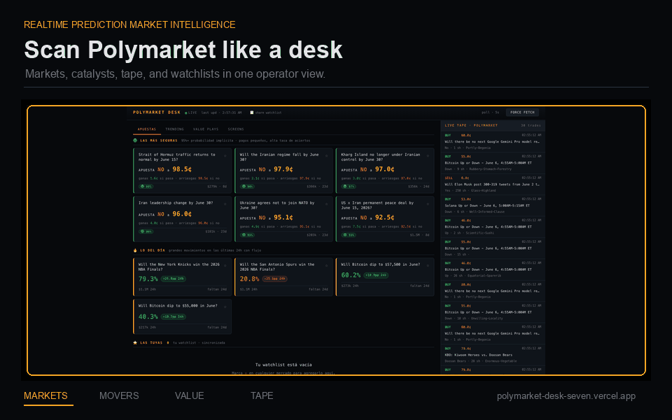
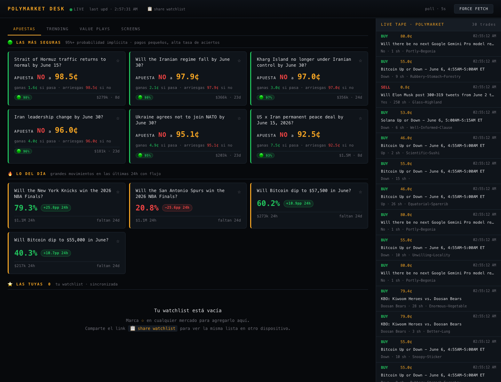
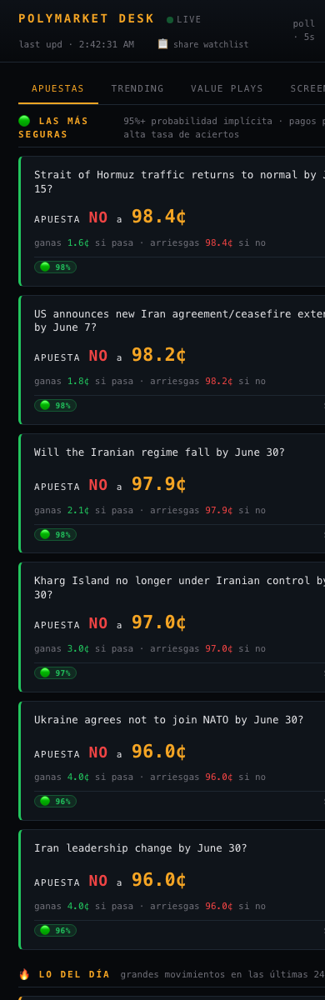

<div align="center">

# Polymarket Desk

**A Bloomberg-style command center for Polymarket market flow, movers, value screens, and live trade tape.**

[](https://polymarket-desk-seven.vercel.app)
[](https://github.com/juliosuas/polymarket-desk)
[](#stack)
[](#stack)

[Open the app](https://polymarket-desk-seven.vercel.app) · [API](#api) · [Run locally](#local-development) · [Roadmap](#roadmap)

</div>



## What It Is

Polymarket Desk is a real-time market intelligence dashboard for Polymarket. It pulls public market data, ranks active opportunities, and presents the result in a dense terminal-style interface built for scanning.

It is intentionally **read-only**. It does not place orders, connect wallets, custody funds, or require private Polymarket credentials.

## Why It Exists

Polymarket has a lot of live information, but the useful signal is spread across markets, events, price moves, volume, and trade flow. This project compresses that into one operator view:

- What markets are getting paid attention right now?
- What moved hard in the last 24 hours?
- Where is the crowd extremely confident?
- Which markets deserve a second look before everyone else notices?
- What is printing on the tape right now?

## Live Demo

Production is deployed on Vercel:

```text
https://polymarket-desk-seven.vercel.app
```

## Product Surface

| Area | Purpose |
| --- | --- |
| Market Dashboard | Consensus markets, 24h catalysts, watchlist, and summary stats |
| Trending | Top events, top movers, and highest-flow markets |
| Value Plays | Heuristic screen for extreme prices with meaningful recent volume |
| Screens | High-conviction and top-flow filters for fast scanning |
| Live Tape | Recent public trades across Polymarket |
| Watchlist | Shareable per-user market list backed by Vercel KV |

## Screenshots

### Desktop



### Mobile



## Highlights

- **Fast market triage**: scan top markets, events, movers, and trade flow from one page.
- **Value discovery**: rank markets with extreme implied probabilities and real liquidity.
- **Zero-login watchlists**: browser-generated token, backed by KV, shareable by URL.
- **Serverless data layer**: Python functions aggregate public Polymarket APIs.
- **No build pipeline**: vanilla HTML/CSS/JS frontend, deployable directly on Vercel.
- **Read-only by design**: no trading keys, no wallet connection, no order execution.

## Stack

| Layer | Tech |
| --- | --- |
| Frontend | Vanilla HTML, CSS, JavaScript |
| API | Python serverless functions on Vercel |
| Storage | Vercel KV / Upstash Redis |
| Hosting | Vercel |
| Data | Polymarket Gamma API and Data API |

## Architecture

```text
Browser
  |
  | polls /api/state?u=<token>
  v
Vercel Python Functions
  |-- gamma-api.polymarket.com/markets
  |-- gamma-api.polymarket.com/events
  |-- data-api.polymarket.com/trades
  `-- Vercel KV watchlist lookup
  |
  v
Single normalized dashboard payload
```

Repository layout:

```text
.
|-- api/
|   |-- state.py        # Aggregates Polymarket markets, events, trades, and watchlist
|   `-- watchlist.py    # Watchlist CRUD using Vercel KV / Upstash Redis
|-- docs/
|   `-- screenshots/    # README screenshots
|-- public/
|   `-- index.html      # Single-page dashboard
|-- vercel.json         # Rewrites, CORS headers, and function limits
`-- README.md
```

## Data Sources

Polymarket Desk uses public unauthenticated endpoints:

- `https://gamma-api.polymarket.com/markets`
- `https://gamma-api.polymarket.com/events`
- `https://data-api.polymarket.com/trades`

The API layer normalizes those upstream responses into a single `/api/state` payload used by the dashboard.

## API

### `GET /api/state`

Returns the combined dashboard state.

Optional query parameter:

- `u`: user token used to resolve the watchlist.

Representative fields:

| Field | Description |
| --- | --- |
| `ts` | API response timestamp |
| `safest` | High-consensus near-term markets |
| `today_movers` | Large 24h price movers with volume |
| `trending_markets` | Top individual markets by 24h volume |
| `events` | Top grouped events by 24h volume |
| `value_plays` | Heuristic extreme-price screen |
| `high_conv` | High-conviction screen |
| `top_flow` | Top liquid markets |
| `trades` | Latest public trade tape |
| `watchlist` | Resolved watchlist markets when `u` is provided |

### `GET /api/watchlist?u=<token>`

Returns saved watchlist slugs for a user token.

### `POST /api/watchlist?u=<token>`

Adds a slug to the watchlist.

```json
{ "slug": "example-market-slug" }
```

### `DELETE /api/watchlist?u=<token>&slug=<slug>`

Removes a slug from the watchlist.

## User Identity Model

There is no login system. On first load, the browser generates a UUID and stores it in:

```text
localStorage["polydash_user"]
```

That token is sent as `?u=<token>` to the API. The share action copies a URL containing the token, which lets another browser or device adopt the same watchlist.

Treat watchlist links as bearer-style edit links. Anyone with the token can view and modify that watchlist.

## Value Plays Scoring

The value screen ranks markets with extreme implied prices, meaningful volume, and a medium-term horizon.

```text
score = extremity * log(liquidity) * (1 + movement)
```

This is a discovery screen, not a trading recommendation. It highlights candidates for deeper independent research.

## Local Development

Prerequisites:

- Vercel CLI
- Python 3.11+
- Vercel KV / Upstash Redis for watchlist persistence

Clone and run:

```bash
git clone https://github.com/juliosuas/polymarket-desk.git
cd polymarket-desk
vercel dev
```

The app runs at:

```text
http://localhost:3000
```

Without KV environment variables, market data can still render, but watchlist reads/writes will fail.

## Environment Variables

Production expects Vercel KV variables:

```text
KV_REST_API_URL
KV_REST_API_TOKEN
KV_REST_API_READ_ONLY_TOKEN
```

When Vercel KV is connected through the Vercel dashboard, these are injected automatically.

## Deployment

The project is configured for Vercel.

```bash
vercel deploy --prod
```

Current production URL:

```text
https://polymarket-desk-seven.vercel.app
```

## Roadmap

- Add analytics for visitors, sessions, and most-used screens.
- Add saved filters and named watchlists.
- Add Telegram/Discord alerts for price moves and volume spikes.
- Add historical snapshots for charts and momentum curves.
- Add richer market detail pages with event context.
- Add optional authenticated accounts while keeping the public dashboard read-only.

## Security And Privacy

- No trading execution or wallet connection is implemented.
- No Polymarket API keys are required.
- Watchlist state is keyed by opaque browser tokens.
- Watchlist share links are bearer-style edit links.
- `.env*.local` and `.vercel/` are ignored and should not be committed.

## Limitations

- No historical database or backfilled chart storage yet.
- No authenticated user accounts yet.
- No analytics tracking is currently installed.
- Watchlists are simple slug arrays capped server-side.
- Market screens are heuristics and should be independently validated.

## Disclaimer

This project is for market monitoring and research. It is not financial advice, not a trading system, and not an endorsement of any market position. Trading prediction markets involves risk and may be restricted by jurisdiction.

## License

Personal project. Polymarket data belongs to its respective providers.
